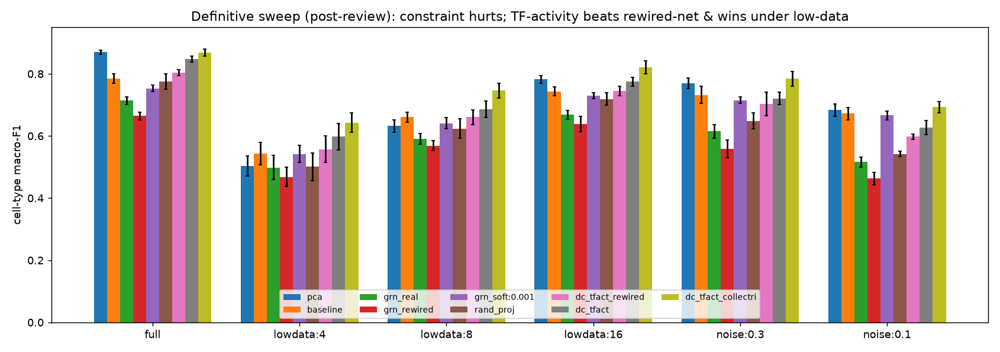
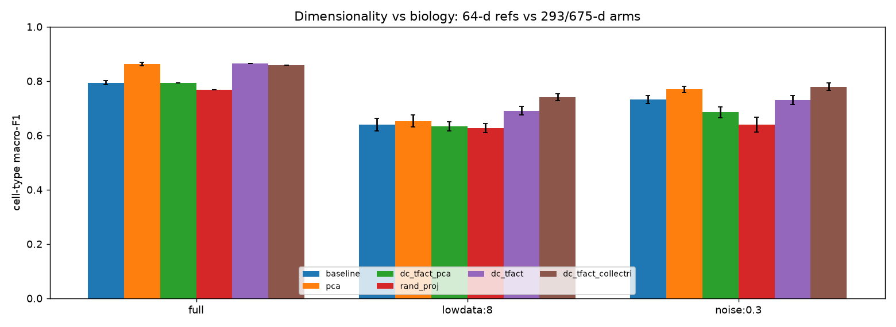
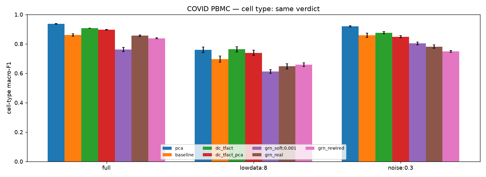
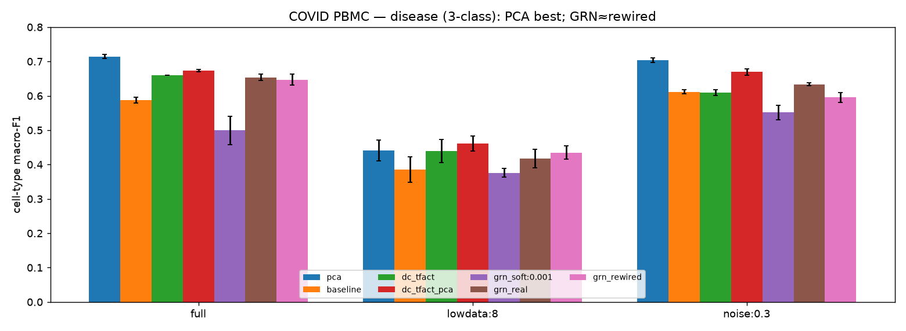
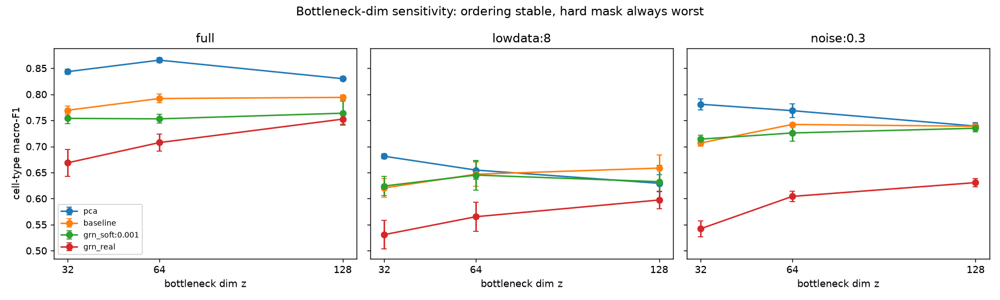

# Results — detailed

The full evaluation. For *what* each model is see [Models](models.md); for *how* it's measured see
[Evaluation](evaluation.md); to run it yourself see the
[evaluation notebook](https://github.com/sbartek/grn-prior-benchmark/blob/main/notebooks/03_evaluation.ipynb).
All numbers are **cell-type macro-F1** (donor-grouped 5-fold CV) unless noted.

## Headline
**How you *use* the GRN matters more than whether you use it.** Baked into a learned encoder it
*hurts*; used as a fixed **TF-activity transform** it carries real signal and **wins under low
data**; and the winner even **depends on the metric** (PCA wins the supervised probe but is worst
on unsupervised clustering).

## Consolidated comparison table

| Model | Prim full | Prim k=8 | Prim noise | COVID full | COVID k=8 | COVID noise | COVID disease | Cluster ARI |
|---|---|---|---|---|---|---|---|---|
| PCA | **0.869** | 0.632 | 0.770 | **0.936** | 0.760 | **0.919** | **0.715** | 0.12 |
| baseline (dense AE) | 0.785 | 0.661 | 0.732 | 0.860 | 0.696 | 0.859 | 0.588 | 0.26 |
| dc_tfact | 0.847 | 0.686 | 0.720 | 0.906 | **0.763** | 0.876 | 0.659 | 0.28 |
| dc_tfact_collectri | **0.869** | **0.746** | **0.784** | – | – | – | – | **0.30** |
| dc_tfact_pca | 0.783 | 0.630 | 0.686 | 0.896 | 0.739 | 0.849 | 0.673 | – |
| rand_proj (null) | 0.775 | 0.624 | 0.648 | – | – | – | – | – |
| dc_tfact_rewired (null) | 0.804 | 0.661 | 0.703 | – | – | – | – | – |
| grn_real (encoder) | 0.714 | 0.591 | 0.615 | 0.855 | 0.647 | 0.781 | 0.654 | 0.21 |
| grn_rewired (null) | 0.665 | 0.569 | 0.559 | 0.838 | 0.659 | 0.749 | 0.646 | – |
| grn_soft:0.001 | 0.753 | 0.641 | 0.715 | 0.762 | 0.613 | 0.803 | 0.499 | – |
| grn_decoder | 0.738 | 0.612 | 0.656 | 0.832 | 0.622 | 0.814 | 0.664 | 0.24 |
| grn_symmetric | 0.675 | 0.557 | 0.595 | 0.818 | 0.588 | 0.774 | 0.639 | – |

*Prim = primary RA PBMC · COVID = second dataset · k=8 = 8 training donors · noise = count-thinning
p=0.3 · COVID disease = 3-class (chance ≈ 0.33) · Cluster ARI = unsupervised KMeans vs cell type ·
– = not run for that model.*

## The two ways to use the graph

`grn_*` (encoder constraint) sits below PCA/baseline everywhere and corrupted graphs do as well
(regularization, not biology). `dc_tfact` (transform) beats its rewired-net and random nulls, and
wins under low data (CollecTRI strongest).

## Dimensionality vs biology

`dc_tfact` (293-d) beats `rand_proj` (293-d random) everywhere → the biology is real, not just
dimensionality. But at 64-d (`dc_tfact_pca`) it ≈ baseline, and at full data it only ties PCA.

## External validity — COVID PBMC

Same ordering on a second dataset (75 donors, 28 cell types) → not RA-specific.

## Disease — decodable on COVID (but confounded)

RA disease (2-class) is at chance; COVID disease (3-class) **is** decodable (PCA best, 0.715) — but
between-subjects, so partly donor identity.

## Robustness — bottleneck dimension

Ordering stable across z ∈ {32, 64, 128}; the hard mask is always worst → not a z=64 artifact.

## Supervised probe vs unsupervised clustering — the metric flips the winner
The `Cluster ARI` column tells a different story from the probe: **PCA is worst (0.12)** while
GRN-informed **CollecTRI TF-activity is best (0.30)**, with the autoencoders above PCA too. PCA
maximizes linear *separability* but leaves overlapping geometry; the biological representations form
**tighter clusters**. So "PCA wins" was probe-specific. (See the clustering + DBSCAN demo in the
[evaluation notebook](https://github.com/sbartek/grn-prior-benchmark/blob/main/notebooks/03_evaluation.ipynb).)

## Biology vs batch — donor leakage

Donor-predictability (lower = less batch leakage): the prior doesn't reduce donor signal; the plain
baseline leaks least.

## Confidence / density ablation

High-confidence (A) DoRothEA edges ≈ baseline, but a rewired-A graph matches them → the density
effect is regularization, not the specific edges.

## Verdict
- **Graph-as-encoder-constraint hurts** — below PCA/baseline, corrupted graphs do as well.
- **Graph-as-TF-activity-transform helps** — real biology (beats rewired-net & random), wins under
  **low data**, not prior-specific (CollecTRI ≥ DoRothEA), replicates on COVID.
- **Placement matters** — decoder > encoder > symmetric, none beats the dense baseline.
- **The metric matters** — PCA wins the probe, loses the clustering.
- **Honest scope** — disease is only decodable where the design allows (COVID), and even there it's
  partly donor identity.
