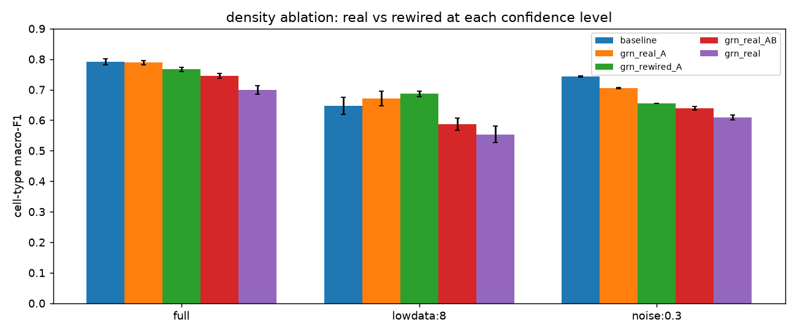

# Results

Full interpretation in [`memo/memo.md`](https://github.com/sbartek/grn-prior-benchmark/blob/main/memo/memo.md).
All scores: donor-grouped 5-fold CV, macro-F1, mean over 2 seeds.

## Dataset suitability (Step 1, confirmed on data)
108,717 cells × 61,497 genes, **raw integer counts**. Balanced **18 RA / 18 normal** donors;
**no sex confound** (12F/6M in both arms); **single assay** (10x 3′ v3, so no assay–disease
confound); **15 cell types** present (some rare: CD4 α-β T 595 cells, γδ-T 1,424). Design is
between-subjects → disease is confounded with donor. Consequence: **cell type** = trustworthy
readout, **disease** = suggestive only, always splitting by donor.

## Headline
**The DoRothEA prior did not usefully improve embeddings — and where it seems to, density (not
biology) is the cause.** The full ABC graph trails PCA and the baseline everywhere; a
high-confidence A-subset closes the gap, but rewired-A controls show that is a
sparsity/regularization effect, not regulatory structure. The specific topology adds only a small
margin over its rewired control (full data, noise) and never beats the baseline. Disease is not
decodable from held-out donors. A fair, mostly **negative result**, carefully scoped.

## Full-data comparison

Cell type: PCA **0.868** > baseline 0.791 > random 0.731 > real 0.699 = sign-shuffled 0.699 >
rewired 0.650. The real graph does **not** beat its same-density controls — the decisive test is
negative: any effect is sparsity, not regulatory content.

## Low-data

Baseline > grn_real > grn_rewired at every training-donor count (k=4/8/16). The prior does not
rescue the low-data regime; but grn_real consistently edges grn_rewired (weak structural signal).

## Noise robustness

Same ordering under count-thinning (p=0.3, 0.1). The prior does not improve noise robustness.

## Graph corruption (decisive)
At full data grn_real (0.699) ties sign-shuffled (0.699) and is **below random** (0.731). Under
low-data/noise grn_real > grn_rewired but the gap is small and never reaches baseline. Verdict:
the *specific* DoRothEA biology adds little beyond graph density.

## Density ablation (confidence A / AB / ABC, with rewired controls)

Sparser high-confidence graphs beat the dense full graph (real_A 0.788 ≈ baseline 0.791 ≫ real
0.699). But **rewired_A** matches real_A — and *beats* it under low data (0.686 vs 0.671) — so the
improvement is mostly **sparsity/regularization, not biology**. The true topology adds only a
small margin over its rewired control at full data and under noise. Bottom line: what looks like
"the prior helps" is largely a density effect; the specific regulatory structure is a minor lever
and never beats the baseline.

## Biology vs batch/donor

Donor-prediction accuracy (lower = less leakage): baseline 0.086 < random 0.098 < grn_real 0.114
< sign-shuf 0.132 < rewired 0.136 < PCA 0.166. The prior does not reduce donor signal.
